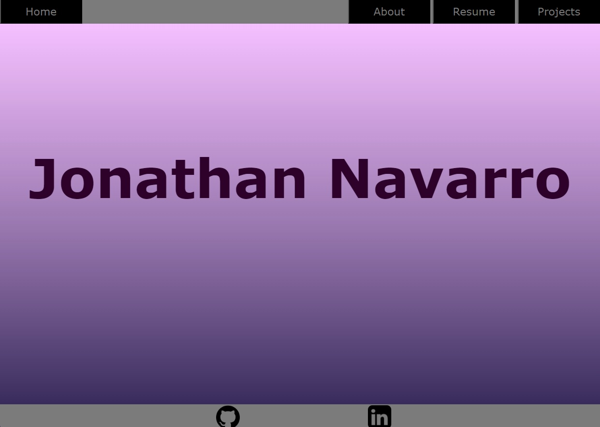
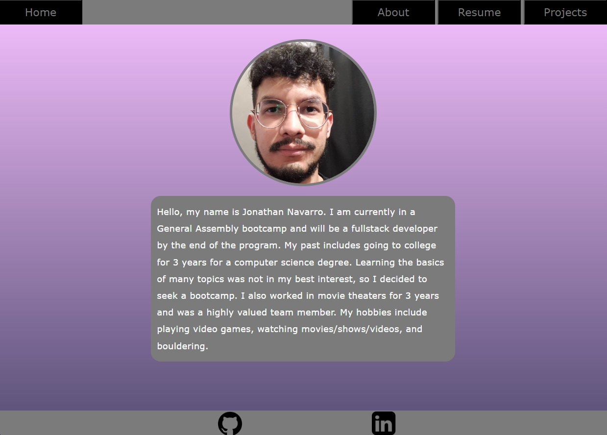
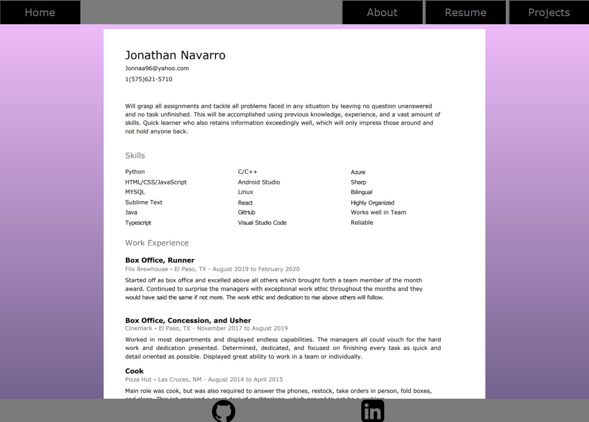
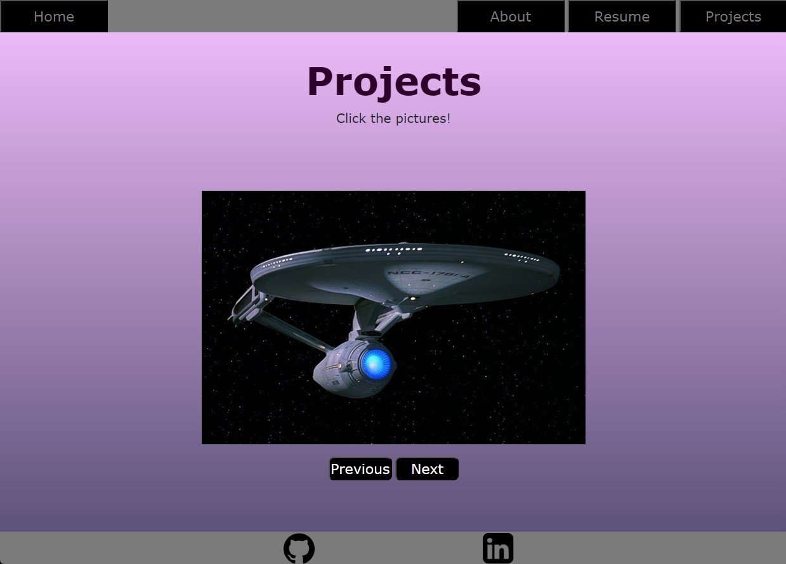
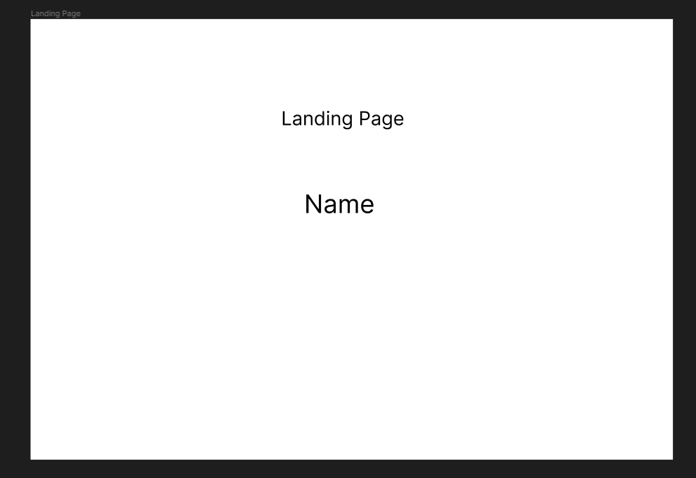
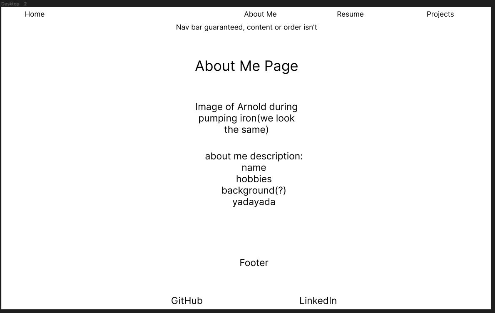
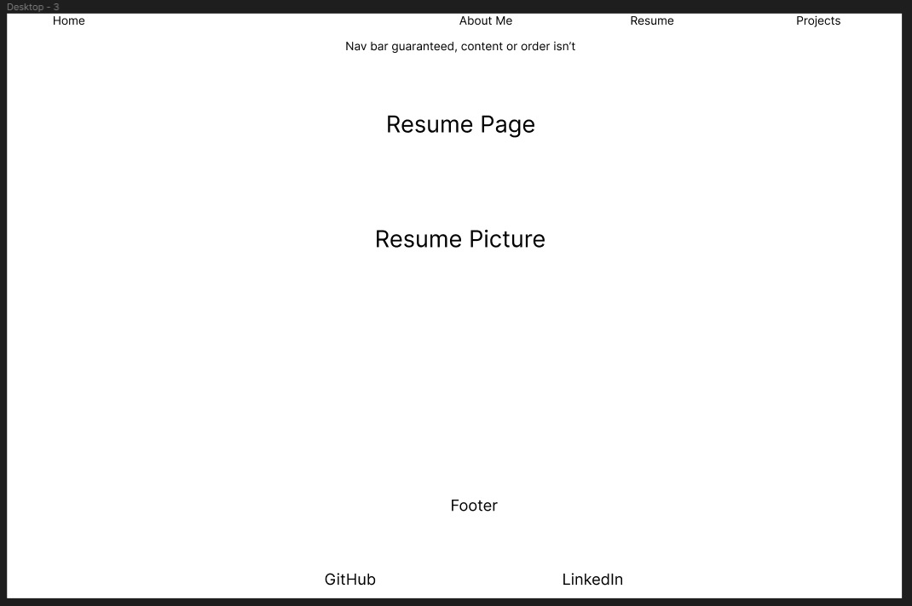
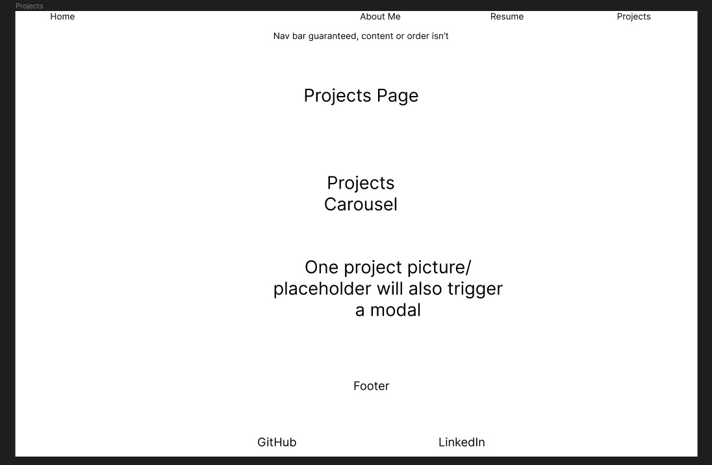

## App Screenshots

## List of technologies used
- Virtual machine on Windows for Ubuntu
- Visual Studio Code with live server extension
- Terminal
- Git commands
- Dev tools

## Installation instructions
- Fork & Clone this repository.
- (Easy Method)
    1. Find the repository in your file explorer
    2. Right click index.html and open with your preferred browser.
- (Harder Method, VSCode with live server extension required)
    1. CD into the cloned repo using the terminal
    2. Enter "code ." into terminal
    3. Click "Go Live" on the bottom right of your VSCode
    4. Click "Open in Browser" on the popup

## User Stories
As a fellow member of the cohort, I would like to go through the site so I may be able to formulate some thoughtful feedback.

As a GA Instructor, I would like to see that every aspect of the site works, and that the MVP has been met so I may then pass the student.

As a friend of the student, I would like to see that the student is putting his knowledge to use, and that the site is a solid foundation for a portfolio that can be updated with projects later on after the cohort.

## Wireframes

## Unsolved problems and/or major hurdles
An unsolved problem is that styling elements seems like a life-long task as I always find something to tweak

A slight hurdle was that I initially used bootstrap for some elements, but decided at the end to configure the elements and breakpoints on my own

## Next steps for the application
I will be adding future projects to this portfolio

The portfolio will probably get a complete change once I learn new things(looking at react)